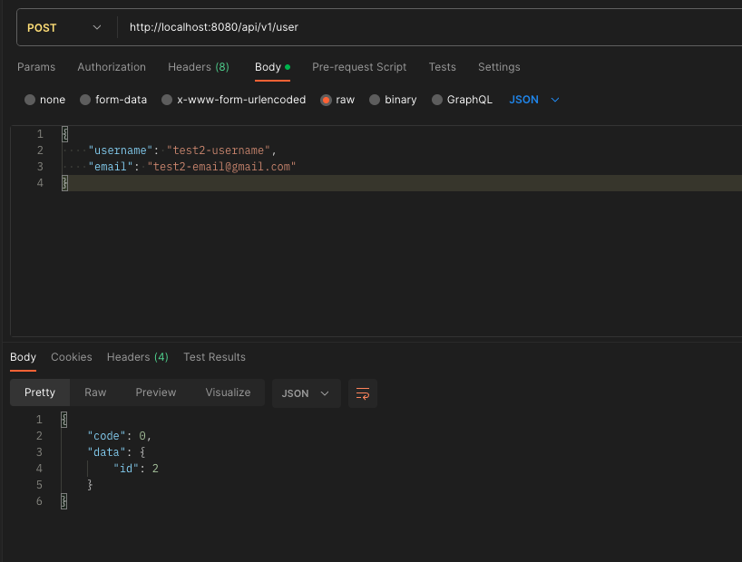
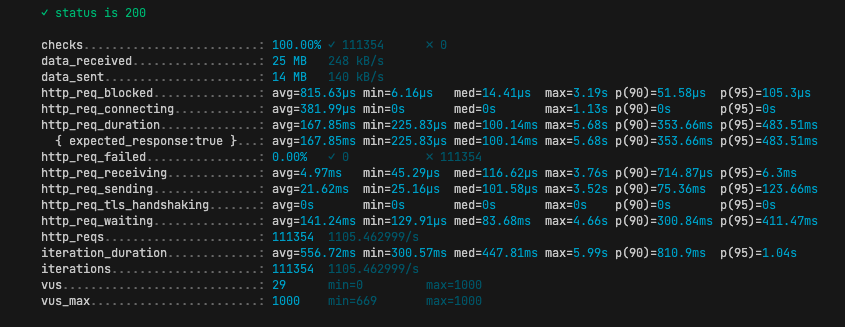

## Pi test

By Tanatorn Nateesanprasert

---
This application contains 3 main components
1. Golang application container
2. Postgres container
3. Redis container

---
#### How to run?
1. run docker command on terminal: `docker compose up`
2. application runs on port `8080`
3. swagger url: `http://localhost:8080/swagger/index.html`

### Load testing
I've also done some load testing on application by using tools like k6, influxDB and grafana

Component
- load test script locate in ./scripts
- sh file script for easily run load test
- docker compose file for load test component
- yaml file for grafana setup dashboard, datasource

Steps for load testing
1. run application container and add some data for testing
  
    ex: req [POST] localhost:8080/api/v1/user to create user
    then get returned user-id for using in get request load test 
    
2. build docker for load test:
   ```
   docker compose -f docker-compose.loadtest.yaml up -d
   ```
3. run load test script:
   ```
   sh run-load-test.sh
   ```

Example result of load test data with max 1000 VUs

